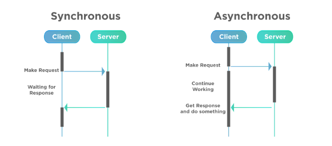
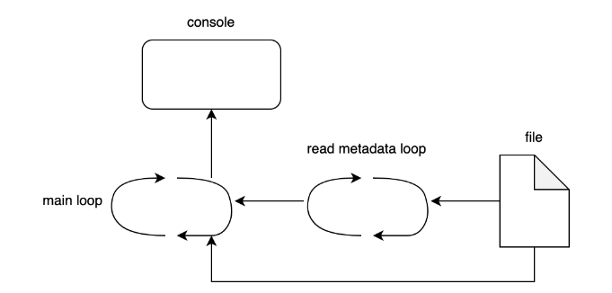

# Why Async

For years engineers have been spoiled with the relentless increase in performances in computer hardware. Moore's law has been a reliable friend, and the increase in CPU clock speed has been a given. 
However, the last decade has seen a plateau in the increase of CPU clock speed. 
Instead, the number of cores has been increasing. This has led to a shift in how we write software. 
Instead of relying on faster CPUs that can chew through our programs more efficiently, we now rely on more CPUs in order to make our programs faster. 
This has created a unique challenge  as a paradigm shift was needed from developers writing predominantly syncrhronous code to writing asynchronous code in order to take advantage of the forementioned increase in CPU Cores. 
In other words this led to the rise of parallel and concurrent programming. 
A key part of concurrent programming is async programming.

Why? We live our lives in an async way, for instance you don't wait for your disherwasher to be ready simply standing there, and staring at it until you can unload your dishes. 
You do other things while waiting for it to finish. Thus, if we want our programes to live a similarly efficient life we need to embrace async programming.

## What is async programming?
When we use a computer we would like it to perform multiple tasks at the same time. Otherwise using it would be a pretty sluggish user experience. At any given time a modern operating system will be running thousands of processes. Try opening your activity monitor, or writing "ps -A" if you are on linux. These processes are not running in parralel but are being handled by a scheduler. The scheduler can at any time pause a process and switch to another process. 

There are multiple nuances to modern CPU deisgn. What we need to know is that a portion of CPU time is allocated when a thread or process is created. The thread is then scheduled to run on a CPU core. The CPU core will then execute the instructions of the thread. The thread runs until it is either interrupted or it is yielded by the CPU. Once a thread has been yielded, the CPU core can then switch to running another thread. 

## Simple real world example of async programming

Tokio is a high level rust abstraction of an async runtime, reqwest enables us to make http requests, it is a high level abstraction on top of the http engine hyper. We can use these two libraries to make an async http request. 

### Action 1: Uncomment sync_http_calls
### Action 2: Uncomment async_http_calls

The results of running this code is an execution time of 251 ms.
This is essentially just synchronous code, each request will be made one after the other. We can make the requests concurrently by using the tokio::join! macro.
The results of running this code was 126ms. This is a 50% improvement in execution time.

This is essentially async programming. Using async programming, we can free up CPU resources by not blocking the CPU with tasks that can be waited on

### Processes
A process is a program executed by a cpu, the instructions are loaded into memory and the CPU executes these instructions to perform a task or a set of tasks. Processes are like threads for external inputs, or data from other processes and can generate an output.

Processes differ from threads since each process consits of its own memory space, this is called an address space. This means that processes cannot access the memory of other processes. Threads on the other hand share the same memory space. This means that threads can access the memory of other threads. A process has an ID called a PID. This is an unique identifier that an OS assigns to a process. It allows the OS to keep track of all resources associated with a process. Useful for when a process needs to be terminated so that the OS can free up the resources associated with the process. 

If two threads have to address the same memory space, we need to introduce synchronization mechanisms such as a primitive known as a Lock. In rust this is implemented as a Mutex. This adds complexity and can lead to bugs such as the infamous deadlock where all threads are waiting for each other to release a lock. 

Thus one could wrongly conclude that we do not need async programming since we can just use processes to achieve the same result. However, processes are expensive to create and maintain. So if we have a lot of processes, we can easily run out of memory. Once we start using all our cores the extra processes will not lead to any performance improvements as they will start to get blocked by the OS scheduler.

## Threads 

Threads are the smallest unit of execution that a CPU can handle. Threads are like processes but they share the same memory space. Threads and tasks are both managed by a scheduler but there is a distict difference. Threads can run at the same time on different CPU cores, while async tasks usually wait their turn to use the CPU.
        
3074 ms
### Action 3: uncomment single_threaded_fib

    ### Action 4: uncomment multi_threaded_fib

808 ms which is a 74% improvement in execution time.

JoinHandles represent ownership of the ability to wait for a thread to finish, effectively blocking the program until that thread completes.  The join method is used to wait for the thread to finish and return the result of the computation.  JoinHandles implement the Send and Sync traits which means that JoinHandles can be sent between threads. However, it must be noted that the JoinHandle does not implement the Clone trait. This is because we need a unique JoinHandle for each thread. If there were multiple JoinHandles for one thread, you can run the risk of multiple threads trying to join the running thread, leading to data races.

### Green Threads

Green threads are threads that are scheduled by a runtime library or a virtual machine instead of the OS. This means that green threads are not managed by the OS scheduler. This means that green threads are much cheaper to create and maintain than OS threads. This is because the OS does not need to allocate memory for the thread. Instead, the runtime library or virtual machine can manage the threads. This means that green threads can be created and destroyed much faster than OS threads. This makes green threads ideal for async programming. In Rust runtime libraries such as tokio and async-std use green threads to manage async tasks. 

With threads we can see that we can handle multiple CPU intensive tasks concurrently. After joining the threads we can see that the executiont time is much faster and we can now use the result of the parallel processing in our main program if we wanted to. 

As mentioned before threads can diferctly interact with each other over memory within a program. There are multiple ways to do this in rust, channels is one and Arc's, atomic variables and mutexes are another.

Arc
    This stands for Atomic Reference Counting, meaning that Arc keeps count of the amount of references to the variable that is wrapped in an Arc. So, if we were to define an Arc<i32> and then reference that Arc<i32> over four threads, the reference count would increase to four. The Arc<i32> would only be dropped when all four threads had finished referencing it resulting in the reference count being zero.

Mutex
    Remember that Rust only allows us to have one mutable reference to a variable at any given time? A Mutex is a smart pointer type that provides interior mutability by having the value inside the Mutex. This means that we can provide mutable access to a single variable over multiple different threads. This is achieved by a thread acquiring the lock. When we acquire the lock, we get the single mutable reference to the value inside the Mutex. We then perform a transaction, and then give up the lock to allow other threads to perform a transaction. The lock ensures that only one thread will have access to the mutable reference at a time ensuring that Rust’s rule of only one mutable reference at a time is not violated. We must note that there is an overhead of acquiring the lock as we might have to wait until it is released.
    The only time using unwrap() might be acceptable is when locking a mutex because the only reason it would panic is if a thread previously panicked while holding the lock, which is called lock poisoning.

 Conditional Variable
    Condition variables represent the ability to block a thread such that it consumes no CPU time while waiting for an event to occur. Condition variables are typically associated with a boolean predicate (a condition) and a mutex. The predicate is always verified inside of the mutex before determining that a thread must block.

Atomic variable
    Safe to share between threads. Atomic types provide primitive shared-memory communication between threads, and are the building blocks of other concurrent types.

### action 5: (shared.rs) Uncomment the code sharing_data_between_threads
 Adding multiple condvars for the updater_thread to cycle through and check would result in one thread keeping track of multiple tasks and acting on those tasks when changed. 

This was a toy example.

### Real world async

Question to all: Think about what we can use async for in the real world?

Things where we wait for a response, such as a web server, a database, a file system, or a network request. In other words: IO and network bound tasks are the best candidates for async programming. I/O operations like writing files are considered slow 
compared to in memory operation because they rely on the speed of the disk.. Hard-drives rely on mechanical parts that need to physically move which is slower than electronic operations in RAM or CPU cache. In adittion to this the speed in which the data can be transferred from the CPU to the device may be limited by the connection speed.

Typically CPU operations are at the nanosecond level, while disk operations are at the millisecond level. This is a 1,000,000 times difference in speed. This has a huge impact on the performance of our programs. If we have a program that is waiting for a disk operation to complete, the CPU is essentially doing nothing. 

## Async I/O 

If we use a Tokio thread to run this function, 
the Tokio runtime will be able to switch context and execute another thread in the same process.
If we use the standard library’s sleep function, the thread will block. 
This is because the standard library’s sleep will not send the task to the Tokio executor

We create a channel that is a Single Producer Multi Consumer channel that only retains the last set value. This is a channel allows one producer to send messages to multiple consumers, enabling concurrent data distribution.
We then pass the transmitter of that channel into our watch file function which is being run in a tokio thread that we spin off.
Now our file watch loop is running, we then move onto our loop that essentially holds until the the value of the channel is changed.
Because we do not care about the value coming from the channel, we merely denote the variable assignment as an underscore. Our main loop will stay there until there is a change in the value inside the channel.
Once the value inside the channel changes due to the metadata of the file changing, the rest of the loop interaction executes, reading the file and printing out the contents.

Now that we have utilised async programmig locally, we can now go back to implementing async programming with networks.

### Action 6:: Uncomment file_demo

## Async Networking

I/O Operations include getting information from an API, executing operations on a database or waiting for information from mouse / keyboard.
What ties these operations together is that they are all slow compared to in memory operations. Async allows the program to continue without
being blocked by the ongoing I/O operation. Other tasks can thus be performed while we wait, allowing for a much more fluid user experience.

### Action 7: Uncomment async_http_example

